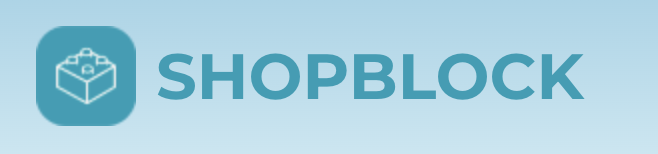

# SHOPBLOCK 🛍



[Frontend](https://github.com/KuaLiMin/ShopBlock/tree/main/frontend) | [Backend](https://github.com/KuaLiMin/ShopBlock/tree/main/backend) | [Demo Video](https://www.youtube.com/watch?v=3N9Mm8eZ2Po)

## Table of Contents

1. [What is ShopBlock?](#1-what-is-shopblock)
   - 1.1 [Demo Video](#11-demo-video)
2. [Getting Started](#getting-started)
   - 2.1 [Prerequisites](#prerequisites)
   - 2.2 [Setup Instructions](#setup-instructions)
     - [Backend Setup](#backend-setup)
     - [Frontend Setup](#frontend-setup)
   - 2.3 [File Structure](#23-file-structure)
   - 2.4 [Tech Stack](#24-tech-stack)
   - 2.5 [Final Report](#25-final-report)
   - 2.6 [Diagrams](#26-diagrams)

---

## 1. What is ShopBlock?

ShopBlock is a platform designed not just for buying and selling, but with a focus on supporting sustainable and affordable access to goods and services through rentals. By enabling users to create, post, browse, and manage listings, ShopBlock aims to provide a solution for low-income families who may struggle with the high cost of one-time purchases. The platform also addresses the issue of clutter in the home by offering a space for users to rent out items that are rarely used, like camping gear or specialty tools, allowing others to borrow rather than buy. With features like filtering listings by categories and price, making offers, and completing transactions, ShopBlock provides a flexible, community-oriented marketplace. The inclusion of reviews and ratings also fosters a trustworthy environment where users can confidently connect with one another.

### 1.1 Demo Video

Click on the link below to watch a quick 5-minute demo of the ShopBlock website!  
[Demo Video](https://www.youtube.com/watch?v=3N9Mm8eZ2Po)

---

## 2. Getting Started 

This section provides details on prerequisites, setup instructions for both frontend and backend, and other technical requirements to get ShopBlock running smoothly.

### Prerequisites 

Before setting up, ensure the following tools are installed:
 
- **Node.js**  and **npm**  (for the frontend)
 
- **Python 3**  and **pip**  (for the backend)

 
- **Virtual Environment**  setup for Python
 
- **Git**  for version control
- 
- **@paypal/paypal-js** (for integrating PayPal payments)

### Setup Instructions 

The setup process is divided into backend and frontend sections.


---


#### Backend Setup 
 
1. **Create a Virtual Environment** 
If not already set up, create and activate a virtual environment:

```bash
python3 -m venv ./swe-env
source ./swe-env/bin/activate
pip3 install -r requirements.txt
```
 
2. **Install the Database** 
Run migrations to initialize the database:

```bash
python3 manage.py migrate
```
 
3. **Apply Database Changes** 
If you modify models, apply migrations with:

```bash
python3 manage.py makemigrations
python3 manage.py migrate
```
 
4. **Run the Backend Server** 
Start the backend server:

```bash
python3 manage.py runserver
```
 
5. **API Testing with Swagger** 
Access the Swagger UI for testing APIs at [http://localhost:8000/api/schema/swagger-ui/](http://localhost:8000/api/schema/swagger-ui/) .
 
6. **Run Unit Tests** 

```bash
python -m pytest .
```
**Developer Notes**  
- **models.py** : Defines ORM models for the database.
 
- **serializers.py** : Handles data formatting for models.
 
- **urls.py** : Maps URLs to views.
 
- **views.py** : Implements core application logic.


---


#### Frontend Setup 
 
1. **Install Node Modules** 
In the `/frontend` directory, install dependencies:

```bash
npm install
```
 
2. **Start the Frontend Application** 

```bash
npm start
```
The application will be accessible at [http://localhost:3000](http://localhost:3000/) .


---


### 2.3 File Structure 
```
└───ShopBlock
    ├───backend
    │   ├───backend (backend files, urls.py and settings)
    │   ├───media
    │   └───(files for migrating and connection to API db)
    └───frontend 
        └───src
            ├───(favicons, index files)
            └───Pages (frontend components)
```


### 2.4 Tech Stack 
 
- **Frontend** : React, Material UI, CSS
 
- **Backend** : Django, Django REST Framework
 
- **Database** : SQLite3
 
- **APIs** : 
  - **PayPal**  for payment processing
 
  - **OneMap**  (Singapore) for location services

---

